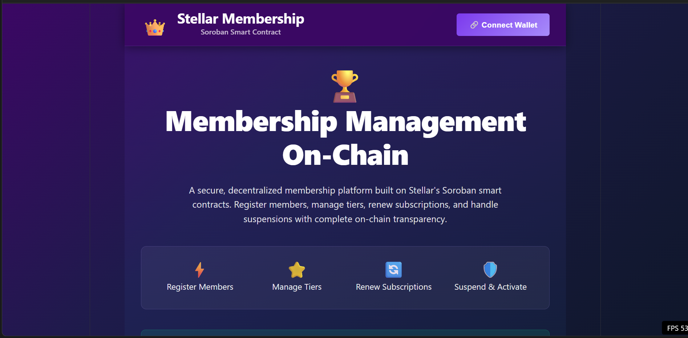
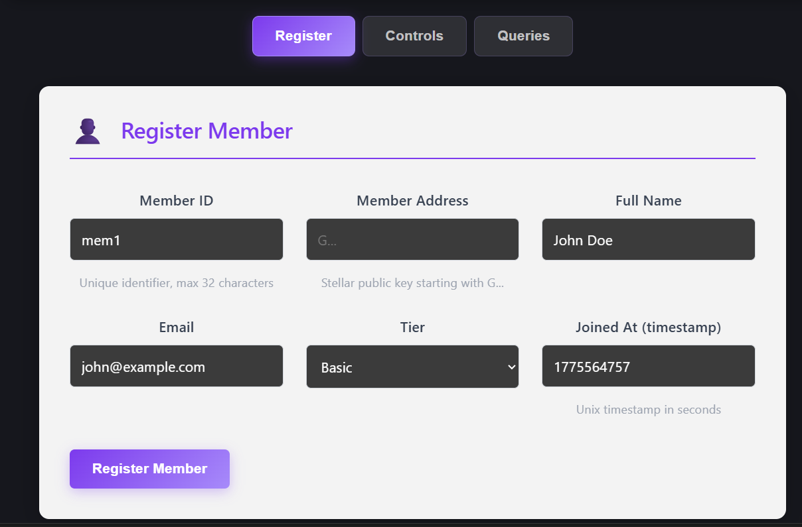
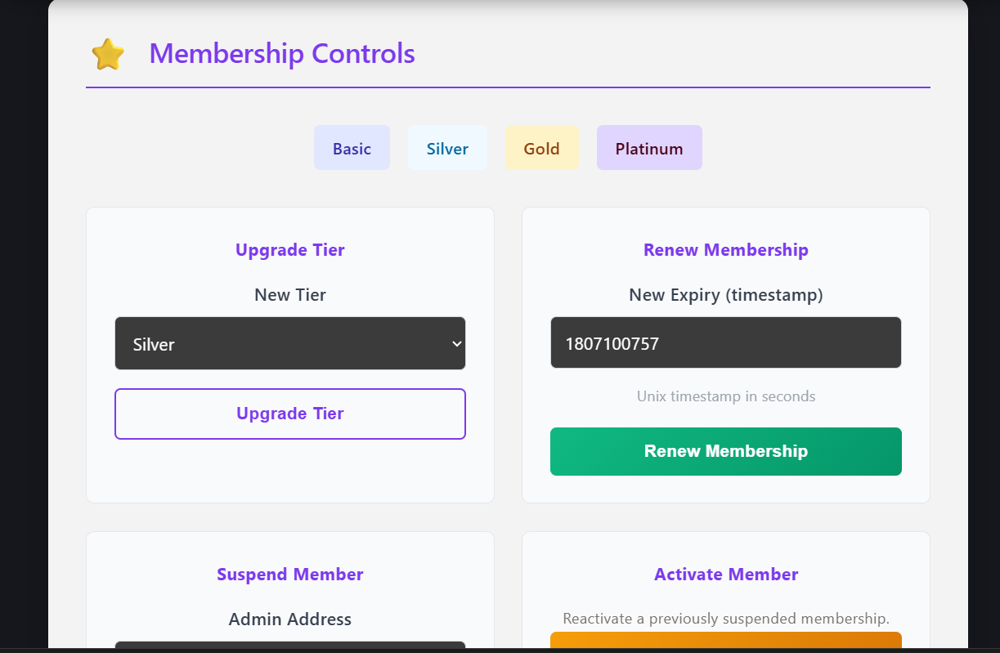

# Stellar Membership Management

A secure, decentralized membership platform built on **Stellar's Soroban** smart contracts. This application allows you to register members, manage membership tiers, renew subscriptions, and handle member suspensions all on-chain.

## Features

✨ **Key Capabilities:**

- **Member Registration** - Register new members with name, email, membership tier, and join date
- **Tier Management** - Upgrade members to higher tiers (Basic → Silver → Gold → Platinum)
- **Subscription Renewal** - Extend membership expiration dates with automatic tracking
- **Member Controls** - Suspend and reactivate member accounts
- **Query Functions** - Look up individual members or view the complete member directory
- **Wallet Integration** - Seamless Freighter wallet connection for transaction signing

## Technology Stack

- **Blockchain**: Stellar Soroban Smart Contracts
- **Frontend**: React 19 + Vite
- **Wallet**: Freighter Wallet Integration
- **RPC**: Stellar Testnet RPC Endpoint

## Live Application

Visit the hosted application at: [Your deployment URL]

**Deployed Contract ID:** `CAAAAAAAAAAAAAAAAAAAAAAAAAAAAAAAAAAAAAAAAAAAAAAAAAAAAWHF`

Explore the contract on Stellar Expert:
[View on Stellar Expert](https://stellar.expert/explorer/testnet/contract/CAAAAAAAAAAAAAAAAAAAAAAAAAAAAAAAAAAAAAAAAAAAAAAAAAAAAWHF)

## Getting Started

### Prerequisites

- Node.js 18+ and npm
- Freighter Wallet browser extension
- Stellar testnet account

### Installation & Setup

1. **Clone the repository:**
```bash
git clone <repository-url>
cd steller-membership-management
```

2. **Install dependencies:**
```bash
npm install
```

3. **Configure the contract:**
Update `src/lib/stellar.js` with your deployed contract details:
```javascript
export const CONTRACT_ID = "YOUR_CONTRACT_ID_HERE";
export const DEMO_ADDR = "YOUR_DEMO_ADDRESS_HERE";
```

4. **Start the development server:**
```bash
npm run dev
```

The application will open at `http://localhost:5173`

## Usage Guide

### 1. Connect Your Wallet
Click the "🔗 Connect Wallet" button in the header to authenticate with Freighter.

### 2. Register Members
Navigate to the **Register** tab to add new members:
- **Member ID**: Unique identifier (max 32 chars)
- **Member Address**: Stellar public key (G...)
- **Full Name**: Member's full name
- **Email**: Member email address
- **Tier**: Starting tier (Basic, Silver, Gold, Platinum)

### 3. Manage Membership
Use the **Controls** tab to:
- **Upgrade Tier**: Advance a member to a higher membership tier
- **Renew Membership**: Extend the membership expiration date
- **Suspend Member**: Temporarily suspend a membership
- **Activate Member**: Reactivate a suspended membership

### 4. Query Members
In the **Queries** tab, you can:
- **Get Member**: Look up a specific member by ID
- **List Members**: View all registered members
- **Get Count**: See the total number of members

## Building for Production

1. **Build the project:**
```bash
npm run build
```

2. **Preview the build:**
```bash
npm run preview
```

3. **Deploy to your hosting platform:**
The optimized `dist/` folder contains the production build.

## Smart Contract

The Soroban contract (`contract/contract.rs`) implements:

- **Member Struct**: Stores member details, tier, status, and dates
- **Data Storage**: Members are indexed by unique ID for efficient lookup
- **Member Lifecycle**: Register, upgrade, renew, suspend, and activate operations
- **Access Control**: Admin functions are restricted to authorized addresses

### Contract Error Codes
- `InvalidName` (1): Name validation failed
- `InvalidTimestamp` (2): Timestamp is invalid
- `MemberNotFound` (3): Member ID doesn't exist
- `NotMember` (4): Address is not a member
- `InvalidTier` (5): Invalid membership tier
- `AlreadySuspended` (6): Member already suspended
- `AlreadyActive` (7): Member already active

## Project Structure

```
steller-membership-management/

├── src/
│   ├── App.jsx                  # Main React component
│   ├── App.css                  # Application styling
│   ├── main.jsx                 # React entry point
│   └── lib/
│       └── stellar.js           # Stellar SDK integration
├── public/                      # Static assets
├── package.json
├── vite.config.js
└── README.md
```

## Environment Variables

The application uses the Stellar Testnet by default. Key configuration is in `src/lib/stellar.js`:

```javascript
const RPC_URL = "https://soroban-testnet.stellar.org";
const NETWORK_PASSPHRASE = Networks.TESTNET;
```

## Development

### Available Scripts

- `npm run dev` - Start development server
- `npm run build` - Build for production
- `npm run preview` - Preview production build
- `npm run lint` - Run ESLint

### Code Quality

The project uses ESLint for code quality:
```bash
npm run lint
```

## Troubleshooting

### "Freighter wallet is not connected"
- Install Freighter extension from the browser store
- Refresh the page and click "Connect Wallet"
- Ensure you're on the Stellar Testnet network

### "Set CONTRACT_ID in lib.js/stellar.js"
- Update `src/lib/stellar.js` with your contract's ID
- The contract must be deployed on Stellar Testnet

### Transaction Timeout
- Check your internet connection
- Ensure Testnet RPC is operational
- Try the transaction again

## Security Considerations

⚠️ **Important:**
- Never share your private keys
- Test thoroughly on Testnet before mainnet deployment
- Contract functions verify transaction signers for admin operations
- All transactions are broadcast to the public blockchain

# Screenshots





## Contributing

Contributions are welcome! Please:
1. Fork the repository
2. Create a feature branch (`git checkout -b feature/amazing-feature`)
3. Commit your changes (`git commit -m 'Add amazing feature'`)
4. Push to the branch (`git push origin feature/amazing-feature`)
5. Open a Pull Request

## License

This project is open source and available under the MIT License.

## Resources

### Documentation
- [Stellar Documentation](https://developers.stellar.org)
- [Soroban Smart Contracts](https://developers.stellar.org/docs/build/smart-contracts)
- [Freighter Wallet API](https://github.com/stellar/freighter/wiki/API)

### Tools
- [Stellar Expert](https://stellar.expert) - Contract explorer
- [Horizon API](https://developers.stellar.org/api) - Blockchain data
- [Stellar Laboratory](https://laboratory.stellar.org) - Transaction builder

## Support

For issues and questions:
- Open an issue on GitHub
- Check existing documentation
- Visit the Stellar Discord community

---

**Built with ❤️ using Stellar Soroban**
